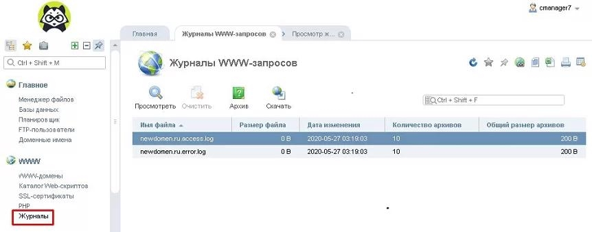
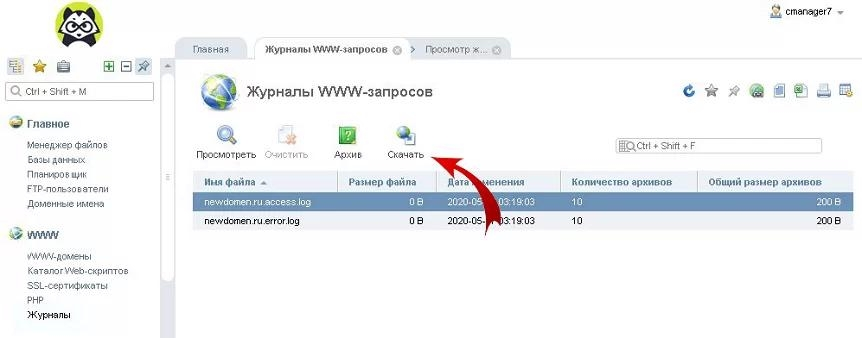
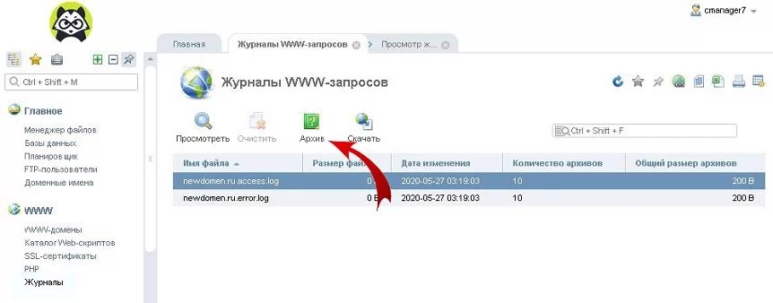
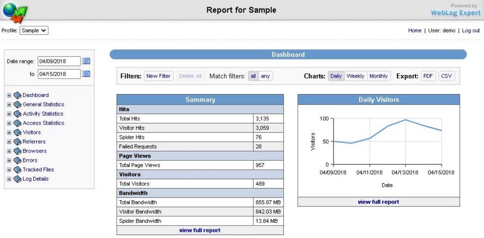
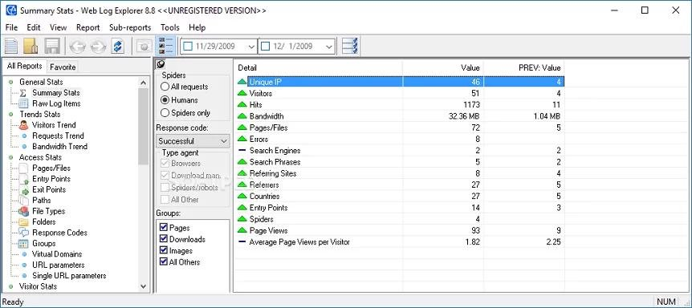
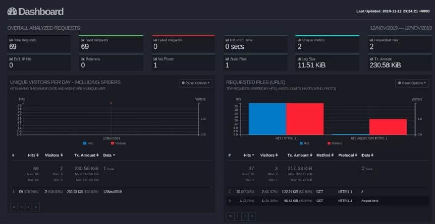
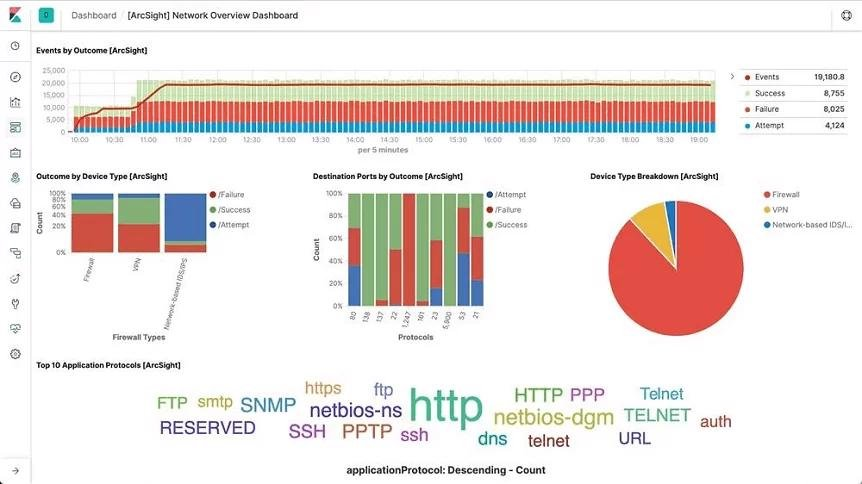

# Просмотр и анализ логов сайта на Linux сервере
## Содержание:
- [Важные логи сайта](#p1)
- [Расположение логов](#p2)
- [Чтение записей в логах](#p3)
- [Просмотр с помощью команды tail](#p4)
- [Просмотр с помощью ISPManager](#p5)
- [Программы для анализа логов](#p6)
- [Ведение логов медленных запросов сервера](#p7)
- [Ведение логов с помощью Logrotate](#p8)

*Логи сайта* — это системные журналы, позволяющие получить информацию о посещении сайта ботами и пользователями, атакже выявить скрытые проблемы на сервере — ошибки, битые ссылки, медленные запросы от сервера и многое другое.

### <a name="p1"></a>Важные логи сайта
`Access.log` — логи посещений пользователей и ботов. Позволяет составить более точную и подробную статистику,
нежели сторонние ресурсы, выполняющие внешнее сканирование сайта и отправляющие ряд ненужных запросовсерверу. Благодаря данному логу можно получить информацию об используемом браузере и IP-адрес посетителя,
данные о местонахождении клиента (страна и город) и многое другое. Стоит обратить внимание, если сайт имеетвысокую посещаемость, то анализ логов сервера потребует больше времени. Поэтому для составления статистикистоит использовать специализированные программы (анализаторы).

`Error.log` — программные ошибки сервера. Стоит внимательно отнестись к анализу данного лога, ведь боты поисковиков,
сканируя, получают все данные о работе сайта. При обнаружении большого количества ошибок, сайт может попасть подсанкции поисковых систем. В свою очередь из записей данного журнала можно узнать точную дату и время ошибки, IP-
адрес получателя, тип и описание ошибки.

`Slow.log` (название зависит от используемой оболочки сервера) — в данный журнал записываются медленные запросысервера. Так принято обозначать запросы с повышенным порогом задержки, выданные пользователю. Этот журналпозволяет выявить слабые места сервера и исправить проблему. Ниже будет рассмотрен способ включить ведениеданного лога на разных типах серверов, а также настройка задержки, с которой записи будут заноситься в файл.

### <a name="p2"></a>Расположение логов
Важно обратить внимание, что местоположение логов сайта по умолчанию зависит от используемого типа оболочки и можетбыть изменено администратором.

#### Стандартные пути до Error.log
##### Nginx
```bash
/var/log/nginx/error.log
```

##### Php-Fpm
```bash
/var/log/php-fpm/error.log
```

##### Apache (CentOS)
```bash
/var/log/httpd/error.log
```

##### Apache (Ubuntu, Debian)
```bash
/var/log/apache2/error.log
```

#### Стандартные пути до Access.log
##### Nginx
```bash
/var/log/nginx/access.log
```

##### Php-Fpm
```bash
/var/log/php-fpm/access.log
```

##### Apache (CentOS)
```bash
/var/log/httpd/access_log
```

##### Apache (Ubuntu, Debian)
```bash
/var/log/apache2/access_log
```

### <a name="p3"></a>Чтение записей в логах
Записи в логах имеют структуру: **одно событие – одна строка**.

Записи в разных логах имеют общие черты, но количество подробностей отличается. Далее будут приведены примеры строкиз разных системных журналов.

#### Примеры записей
##### Error.log
```bash
[Sat Sep 1 15:33:40.719615 2019] [:error] [pid 10706] [client 66.249.66.61:60699] PHP Notice: Undefined variable: moduleclass_sfx in /var/data/www/site.ru/modules/contacts/default.php on line 14
```

*В приведенном примере:*
- `[Sat Sep 1 15:33:40.719615 2019]` — дата и время события.
- `[:error] [pid 10706]` — ошибка и её тип.
- `[client 66.249.66.61:60699]` — IP-адрес подключившегося клиента.
- `PHP Notice: Undefined variable: moduleclass_sfx in` — событие PHP Notice. В данной ситуации — обнаружена неизвестная переменная.
- `/var/data/www/site.ru/modules/contacts/default.php on line 14` — путь и номер строки в проблемном файле.

##### Access.log
```bash
194.61.0.6 – alex [10/Oct/2019:15:32:22 -0700] "GET /apache_pb.gif HTTP/1.0" 200 5396 "http://www.mysite/myserver.html" "Mozilla/4.08 [en] (Win98; I ;Nav)"
```

*В приведенном примере:*
- `194.61.0.6` — IP-адрес пользователя.
- `alex` — если пользователь зарегистрирован в системе, то в логах будет указан идентификатор.
- `[10/Oct/2019:15:32:22 -0700]` — дата и время записи.
- `«GET /apache_pb.gif HTTP/1.0»` — «GET» означает, что определённый документ со страницы сайта был отправлен пользователю. Существует команда «POST», наоборот отправляет конкретные данные (комментарий или любое другоесообщение) на сервер. Далее указан извлечённый документ «Apache_pb.gif», а также использованный протокол «HTTP/1.0».
- `200 5396` — код и количество байтов документа, которые были возвращены сервером.
- `«http://www. www.mysite/myserver.html»` — страница, с которой был произведён запрос на извлечение документа «Apache_pb.gif».
- `«Mozilla/4.08 [en] (Win98; I ;Nav)»` — данные о пользователе, которой произвёл запрос (используемый браузер иоперационная система).

### <a name="p4"></a>Просмотр логов сервера с помощью команды *tail*
Выполнить просмотр логов в Linux можно с помощью команды `tail`. Данный инструмент позволяет смотреть записи в логах,
выводя последние строки из файла. По умолчанию tail выводит 10 строк.

#### Первый вариант использования tail
```bash
tail -f /var/log/syslog
```

Аргумент `-f` позволяет команде делать просмотр событий в режиме реального времени, в ожидании новых записей в логфайлах. Для прерывания процесса следует нажать сочетание клавиш `Ctrl+C`.

На место переменной `/var/log/syslog` в примере следует подставить актуальный адрес до нужных системных журналов.

#### Второй вариант использования tail
```bash
tail -F /var/log/syslog
```

В Linux логи веб-сервера не ведутся до бесконечности, поскольку это усложняет их дальнейший анализ. При преодолениилимита записей, система переименует переполненный строками файл журнала и отправит в «архив». Вместо старого файла создастся новый, но с прежним названием.

Если будет использоваться аргумент `-f`, команда продолжит отслеживание старого, переименованного журнала. Данныйметод делает невозможным просмотр логов в реальном времени, поскольку файл более не актуален.

При использовании аргумента `-F`, команда, после окончания записи старого журнала, перейдёт к чтению нового файла слогами. В таком случае просмотр логов в режиме реального времени продолжится.

#### Аналог команды Tail — tailf
```bash
tailf /var/log/syslog
```

Отличие команды `tailf` от предыдущей заключается в том, что она не обращается к файлу и файловой системе в период, когдаз апись логов не происходит. Это экономит ресурсы системы и заряд, если используется нестационарное устройство — ноутбук, смартфон или планшет.

Недостаток данного способа — проблема с чтением больших файлов. Если системный журнал достаточно большой,
возникает вероятность отказа в работе программы.

#### Изменение стандартного количества строк для вывода

Как и отмечалось выше, по умолчанию выводится 10 строк. Если требуется увеличить или уменьшить их количество, вкоманду добавляется аргумент «-n» и необходимое число строк.

Пример:
```bash
tail -f -n 100 /var/log/syslog
```

При использовании данной команды будут показаны последние 100 строк журнала.

### <a name="p5"></a>Просмотр логов с помощью ISPManager
Если на сервере установлен `ISPManager`, логи можно легко читать, используя приведенный ниже алгоритм.
1. На главной странице, в панели инструментов «WWW» нужно нажать на вкладку *«Журналы»*. 




2. ISPManager выдаст журналы посещений и серверных ошибок в виде:
	- ru.access.log;
	- ru.error.log.<sup>*</sup>

<sup>*</sup> *Вместо «newdomen.ru» из примера в выдаче будет название актуального домена.*

Открыть файл лога можно, нажав на *«Посмотреть»* в верхнем меню.

3. Для просмотра всех записей журнала, необходимо нажать на *«Скачать»* и сохранить файл на локальный носитель.



4. Более старые версии логов можно найти во вкладке «Архив».



### <a name="p6"></a>Программы для анализа логов

Анализировать журналы с большим количеством данных вручную не только сложно, но и чревато ошибками. Для упрощенияработы с лог файлами было создано большое количество сервисов и утилит.

Инструменты для анализа логов делятся на два основных типа — статические и работающие в режиме реального времени.

#### Статические программы

Данный тип выполняет работу только с извлеченными логами, но обеспечивает быструю сортировку данных.

##### WebLog Expert



###### Возможности:
- Предоставление информации об активность сайта, количестве посетителей, доступ к файлам, URL страницы, ссылающиеся страницы, информацию о пользователе (браузер и операционная система).
- Создание отчётов в формате HTML (.html), PDF (.pdf), CSV (.csv).
- Поддерживает анализ логов Nginx, Apache, ISS.
- Чтение файлов даже в архивах ZIP (.zip), GZ (.gz).

##### Web Log Explorer



###### Возможности:
- Создание многоуровневых отчётов, включающих количество посетителей, маршруты пользователей по сайту, местоположение хостов (страна и город), указанные в поисковике ключевые слова.
- Поддержка более 43 форматов логов.
- Возможность прямой загрузки логов с FTP, HTTP сервера.
- Чтение архивированных журналов.

#### Программы для анализа в режиме реального времени
Эти инструменты встраиваются в программную среду сервера, анализируют данные в реальном времени и записывают непрерывный отчёт.

##### GoAccess



###### Возможности:
- Автоматическая генерация отчёта в формате HTML (.html), JSON (.json), CSV (.csv).
- При подключении к серверу через SSH, возможен анализ в браузере и в терминале
- Поддержка почти всех форматов (Apache, Nginx, Amazon S3, Elastic Load Balancing, CloudFront и др.).

##### Logstash



###### Возможности:
- Постоянная генерация отчёта в файл JSON (.json).
- Получение и анализ информации из нескольких источников.
- Возможность пересылать журналы с помощью Filebeat.
- Поддержка анализа системных журналов.
- Поддерживается большое количество форматов: от Apache до Log4j (Java).


### <a name="p7"></a>Ведения логов медленных запросов сервера
Анализ данного лога позволяет определить на какие типы запросов сервер отвечает долго. В идеале задержка должнасоставлять не более 1 секунды.

На некоторых типах оболочек (MySQL, PHP-FPM) ведение данного лога по умолчанию отключено. Процесс запуска и ведениязависит от сервера.

#### MySQL

Если сервер управляется с помощью MySQL, то необходимо создать каталог и сам файл для ведения журнала с помощью команд:
```bash
sudo mkdir /var/log/mysql
sudo touch /var/log/mysql/mysql-slow.log
```

Стоит изменить владельца файла, чтобы избежать дальнейших проблем с записью логов. Делается это командой:
```bash
sudo chown mysql:mysql /var/log/mysql/mysql-slow.log
```

После выполнения предыдущих действий, нужно совершить вход в командную строку MySQL под учётной записью суперпользователя:

```bash 
mysql -uroot -p
```

Для запуска и настройки ведения логов нужно последовательно ввести в терминале следующие команды:

```mysql
SET GLOBAL slow_query_log = 'ON';
SET GLOBAL slow_launch_time = 2;
SET GLOBAL slow_query_log_file = '/var/log/mysql/mysql-slow.log';
FLUSH LOGS;
```

В примере:
- `slow_query_log` — запускает ведение журналов медленных запросов.
- `slow_launch_time` — указывает максимальную задержку отклика, после которой статистика запроса попадёт в журнал. Вданном случае запись в логи происходит при преодолении откликом порога 2 секунды.
- `slow_query_log_file` — задаёт путь до используемого журнала.

Проверить статус и параметры ведения лога медленных запросов можно командой:

```mysql
SHOW VARIABLES LIKE '%slow%';
```

Выход из консоли MySQL выполняется командой:
```mysql
exit;
```

После выполнения всех предыдущих действий, можно просмотреть логи сервера. Для этого в терминале вводится:

```bash 
tail -f /var/log/mysql/mysql-slow.log
```

#### PHP-FPM

Для ведения журнала на данной оболочке, необходимо отредактировать параметры в конфигурационном файле. Для этого втерминале вводится команда:

```bash
sudo mcedit /etc/php-fpm.d/www.conf
```

Далее нужно найти строки:

- `request_slowlog_timeout = 10s` — параметр, позволяющий указать задержку, с которой запись о длительном запросе попадёт в журнал.
- `slowlog = /var/log/php-fpm/www-slow.log` — параметр, указывающий путь до актуального файла логирования (.log).

После применения изменений, необходимо перезагрузить сервер PHP-FPM. Для этого в консоль вводится команда:

```bash 
sudo systemctl restart php-fpm
```

Просмотр логов запускается командой:

```bash
tail -f /var/log/php-fpm/www-slow.log
```

#### Анализ логов медленных запросов
Логи медленных запросов могут за незначительное время вырасти до огромных размеров. Для сортировки и отображенияповторяющихся запросов рекомендуется использовать программу MySQLDumpSlow.

Для запуска просмотра логов с помощью этой утилиты, нужно составить команду по приведенному ниже алгоритму:

```bash
mysqldumpslow /var/log/mysql/mysql-slow.log
```

### <a name="p8"></a>Ведение логов в Logrotate
На больших ресурсах журналы могут достигать огромных размеров, поэтому нужно своевременно архивировать или очищатьлоги. С помощью утилиты Logrotate можно управлять ведением журналов: настроить период ротации (архивированиестарого журнала и создание нового), период и количество хранения журналов и многое другое.

Изначально программа отсутствует в системе. Ниже приведены команды для инсталляции Logrotate из официальныхрепозиториев.

Ubuntu, Debian:

```bash
sudo apt install logrotate
```

CentOS:

```bash
sudo yum install logrotate
```

После установки необходимо проверить путь для будущих конфигурационных файлов. Для правильной работы они должны находится в папке `logrotate.d`. Проверить данный параметр можно открыв конфигурационный файл командой:

```bash
mcedit /etc/logrotate.conf
```

В директории *«RPM packages drop log rotation information into this directory»* должна присутствовать строка:

```logrotate.conf
include /etc/logrotate.d
```

Теперь создаётся конфигурационный файл `rsyslog.conf`. В нём будет находиться конфигурацию по работе с логами. Длясоздания файла в терминале вводится команда:

```bash
sudo mcedit /etc/logrotate.d/rsyslog.conf
```

В окне терминала откроется текстовой редактор. Теперь нужно внести конфигурацию, как указано в образце. В качествепримера будет использоваться журнал посещений «Access.log» (Nginx).

```rsyslog.conf
/var/log/nginx/access.log {
	daily
	rotate 3
	size 500M
	compress
	delaycompress
}
```

Теперь остаётся только запустить Logrotate. Для этого вводится команда:

```bash
sudo logrotate -d /etc/logrotate.d/rsyslog.conf
```

Для проверки правильности работы программы в терминале можно ввести команду:

```bash
ls /var/cron.daily/
```
